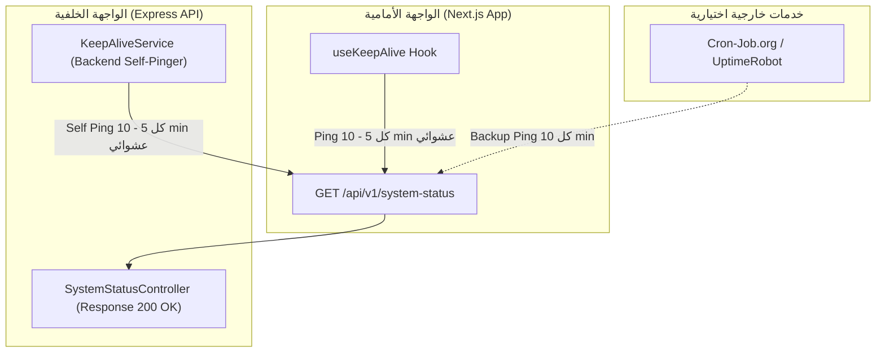

# 📘 التوثيق الشامل لنظام الإنعاش التلقائي المزدوج (Hybrid Keep-Alive Engine)

* **اسم المشروع:** نظام إدارة المصروفات والعقارات (Expense & Real Estate Management System)
* **تاريخ التطبيق:** 29 أغسطس 2026
* **الهدف:** منع خادم الباك إند المرفوع على Render من الدخول في وضع السكون (Sleep Mode) وضمان استجابة سريعة فورية 24/7 دون الاعتماد على مواعيد ثابتة.

---

## 📑 الفهرس
1. [المشكلة الفنية والحل المطبق](#1-المشكلة-الفنية-والحل-المطبق)
2. [هيكلية النظام المزدوج (Hybrid Architecture)](#2-هيكلية-النظام-المزدوج-hybrid-architecture)
3. [تفاصيل المسارات الخفيفة (Ultra-Fast Endpoints)](#3-تفاصيل-المسارات-الخفيفة-ultra-fast-endpoints)
4. [محرك الباك إند العشوائي (Backend Self-Pinger)](#4-محرك-الباك-إند-العشوائي-backend-self-pinger)
5. [ميزة الفرونت إند (Frontend Hook)](#5-ميزة-الفرونت-إند-frontend-hook)
6. [دليل الاستخدام والتكامل الخارجي (External Cron Setup)](#6-دليل-الاستخدام-والتكامل-الخارجي-external-cron-setup)

---

## 1. المشكلة الفنية والحل المطبق

### المشكلة:
تدخل الاستضافة السحابية المجانية/الاقتصادية على منصة **Render** في وضع السكون (Sleep Mode) إذا لم تتلقَّ أي طلبات HTTP لمدة 15 دقيقة متواصلة. عند وصول أول طلب بعدها، يحدث تأخير يُعرف بـ (Cold Start) يستغرق من 30 إلى 50 ثانية.

### الحل المطبق:
تم إنشاء **نظام إنعاش ذكي ومزدوج (Hybrid Keep-Alive System)** يدمج بين الفرونت إند والباك إند:
* **توقيت عشوائي (Randomized Interval):** تتراوح المدة بين كل طلب والذي يليه بين **5 إلى 10 دقائق عشوائياً** لضمان عدم الثبات الزمني ومحاكاة النشاط الطبيعي.
* **استهلاك صفري للموارد (Zero DB Overhead):** الاستجابة تتم عبر مسار خفيف جداً لا يستعلم من قاعدة البيانات ولا يستهلك الذاكرة.

---

## 2. هيكلية النظام المزدوج (Hybrid Architecture)



---

## 3. تفاصيل المسارات الخفيفة (Ultra-Fast Endpoints)

تم إضافة مسارين عامين (Public Routes) لا يستلزمان توكن مصادقة `JWT`:

### أ. المسار الرسمي: `GET /api/v1/system-status`
* **الملف المسؤول:** [`apps/api/src/controllers/systemStatus.controller.ts`](file:///c:/Users/Silver_Bullet/Desktop/exoen_man/apps/api/src/controllers/systemStatus.controller.ts)
* **زمن الاستجابة:** أقل من 5 ملي ثانية.
* **شكل الاستجابة:**
```json
{
  "success": true,
  "service": "Real Estate & Expense Management System",
  "status": "ACTIVE",
  "message": "Server is active, healthy, and ready.",
  "timestamp": "2026-08-29T11:04:00.000Z"
}
```

### ب. المسار المباشر: `GET /ping`
* **الملف المسؤول:** [`apps/api/src/app.ts`](file:///c:/Users/Silver_Bullet/Desktop/exoen_man/apps/api/src/app.ts)
* **زمن الاستجابة:** أقل من 2 ملي ثانية.
* **شكل الاستجابة:**
```json
{
  "status": "ok",
  "message": "pong",
  "timestamp": "2026-08-29T11:04:00.000Z"
}
```

---

## 4. محرك الباك إند العشوائي (Backend Self-Pinger)

* **الملف المسؤول:** [`apps/api/src/services/keepAlive.service.ts`](file:///c:/Users/Silver_Bullet/Desktop/exoen_man/apps/api/src/services/keepAlive.service.ts)
* **طريقة العمل:**
  1. عند إقلاع الخادم، تبدأ الخدمة تلقائياً بواسطة `KeepAliveService.start()`.
  2. يتم حساب عدد دقائق عشوائي بين 5 و 10 دقائق:
     ```typescript
     const randomMinutes = Math.random() * (10 - 5) + 5;
     ```
  3. عند حلول التوقيت، يرسل السيرفر طلب HTTP إلى نفسه، ثم يعيد جدولة التوقيت بفاصل زمني عشوائي جديد.

---

## 5. ميزة الفرونت إند (Frontend Hook)

* **الملف المسؤول:** [`apps/web/hooks/useKeepAlive.ts`](file:///c:/Users/Silver_Bullet/Desktop/exoen_man/apps/web/hooks/useKeepAlive.ts)
* **المكان المدمج فيه:** [`apps/web/context/AuthContext.tsx`](file:///c:/Users/Silver_Bullet/Desktop/exoen_man/apps/web/context/AuthContext.tsx)
* **طريقة العمل:**
  طالما أن تطبيق الفرونت إند مفتوح في متصفح أي مستخدم، يقوم الـ Hook في الخلفية بحساب توقيت عشوائي بين 5 إلى 10 دقائق ويرسل طلب إشعار خفيف للمسار `/system-status`.

---

## 6. دليل الاستخدام والتكامل الخارجي (External Cron Setup)

إذا أردت ربط خدمة خارجية إضافية مثل **[cron-job.org](https://cron-job.org)** كاحتياط إضافي:

1. **الرابط المستهدف (URL):**
   `https://note-expenses-backend.onrender.com/api/v1/system-status`
2. **نوع الطلب (HTTP Method):** `GET`
3. **الجدولة (Schedule):** اختر كل **10 دقائق**.

---
*تم إنشاء هذا التوثيق ليكون مرجعاً تقنياً دائماً لنظام الإنعاش التلقائي.* 🚀
