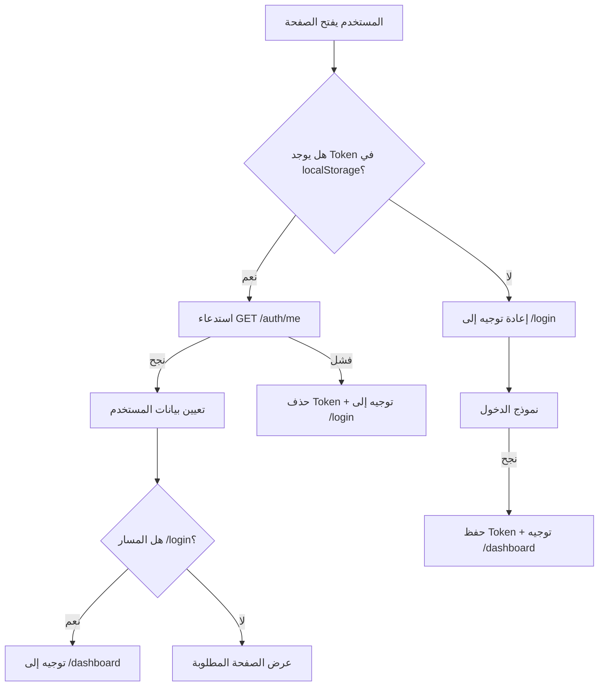

# تحليل وجهات (Routes) تطبيق exoen_man

## نظرة عامة
التطبيق مبني بـ **Next.js App Router** ويستخدم نظام المجلدات لتعريف الوجهات. جميع الوجهات تحتاج مصادقة (Auth) ما عدا `/login`.

---

## خريطة الوجهات الكاملة

```
/                        → يُعيد التوجيه تلقائياً إلى /dashboard
/login                   → صفحة تسجيل الدخول (عامة - Public)
/dashboard               → لوحة المعلومات الرئيسية
/journals                → اليوميات اليومية
/journals/[id]           → تفاصيل يومية بعينها
/transactions/new        → إضافة سند صرف جديد
/unassigned-projects     → سندات غير مرتبطة بمشروع
/reports                 → التقارير المالية (صفحة رئيسية)
/reports/manual-vouchers → السندات اليدوية
/reports/pending-invoices→ الفواتير المعلقة
/projects                → قائمة المشاريع والوحدات
/projects/new            → إنشاء مشروع جديد
/projects/[id]           → تفاصيل مشروع بعينه
/projects/[id]/edit      → تعديل مشروع
/beneficiaries           → قائمة المستفيدين
/categories              → تصنيفات المصروفات
/cashboxes               → الصناديق المالية
/payment-methods         → طرق الدفع
/users                   → إدارة المستخدمين والصلاحيات
/users/new               → إضافة مستخدم جديد
/users/[id]              → تفاصيل مستخدم
/users/[id]/edit         → تعديل مستخدم
/settings                → إعدادات النظام
/audit-logs              → سجل التعديلات (Audit Logs)
```

---

## تصنيف الوجهات حسب النوع

### 🔓 وجهات عامة (Public)
| الوجهة | الملف | الوصف |
|--------|-------|-------|
| `/login` | [page.tsx](file:///c:/Users/Silver_Bullet/Desktop/exoen_man/apps/web/app/login/page.tsx) | نموذج تسجيل الدخول |

### 📊 لوحة التحكم
| الوجهة | الملف | الوصف |
|--------|-------|-------|
| `/` | [page.tsx](file:///c:/Users/Silver_Bullet/Desktop/exoen_man/apps/web/app/page.tsx) | يعيد توجيه إلى `/dashboard` |
| `/dashboard` | [page.tsx](file:///c:/Users/Silver_Bullet/Desktop/exoen_man/apps/web/app/dashboard/page.tsx) | لوحة المعلومات الرئيسية |

### 💰 المعاملات المالية
| الوجهة | الملف | الوصف |
|--------|-------|-------|
| `/transactions/new` | [page.tsx](file:///c:/Users/Silver_Bullet/Desktop/exoen_man/apps/web/app/transactions/new/page.tsx) | إنشاء سند صرف جديد |
| `/journals` | [page.tsx](file:///c:/Users/Silver_Bullet/Desktop/exoen_man/apps/web/app/journals/page.tsx) | عرض اليوميات |
| `/journals/[id]` | [page.tsx](file:///c:/Users/Silver_Bullet/Desktop/exoen_man/apps/web/app/journals/[id]/page.tsx) | تفاصيل يومية محددة |
| `/unassigned-projects` | [page.tsx](file:///c:/Users/Silver_Bullet/Desktop/exoen_man/apps/web/app/unassigned-projects/page.tsx) | سندات بدون مشروع |

### 📋 التقارير
| الوجهة | الملف | الوصف |
|--------|-------|-------|
| `/reports` | [page.tsx](file:///c:/Users/Silver_Bullet/Desktop/exoen_man/apps/web/app/reports/page.tsx) | الصفحة الرئيسية للتقارير |
| `/reports/manual-vouchers` | [page.tsx](file:///c:/Users/Silver_Bullet/Desktop/exoen_man/apps/web/app/reports/manual-vouchers/page.tsx) | تقرير السندات اليدوية |
| `/reports/pending-invoices` | [page.tsx](file:///c:/Users/Silver_Bullet/Desktop/exoen_man/apps/web/app/reports/pending-invoices/page.tsx) | تقرير الفواتير المعلقة |

### 🏗️ إدارة المشاريع
| الوجهة | الملف | الوصف |
|--------|-------|-------|
| `/projects` | [page.tsx](file:///c:/Users/Silver_Bullet/Desktop/exoen_man/apps/web/app/projects/page.tsx) | قائمة المشاريع |
| `/projects/new` | [page.tsx](file:///c:/Users/Silver_Bullet/Desktop/exoen_man/apps/web/app/projects/new/page.tsx) | مشروع جديد |
| `/projects/[id]` | [page.tsx](file:///c:/Users/Silver_Bullet/Desktop/exoen_man/apps/web/app/projects/[id]/page.tsx) | تفاصيل مشروع |
| `/projects/[id]/edit` | [page.tsx](file:///c:/Users/Silver_Bullet/Desktop/exoen_man/apps/web/app/projects/[id]/edit/page.tsx) | تعديل مشروع |

### 👥 إدارة المستخدمين
| الوجهة | الملف | الوصف |
|--------|-------|-------|
| `/users` | [page.tsx](file:///c:/Users/Silver_Bullet/Desktop/exoen_man/apps/web/app/users/page.tsx) | قائمة المستخدمين |
| `/users/new` | [page.tsx](file:///c:/Users/Silver_Bullet/Desktop/exoen_man/apps/web/app/users/new/page.tsx) | مستخدم جديد |
| `/users/[id]` | [page.tsx](file:///c:/Users/Silver_Bullet/Desktop/exoen_man/apps/web/app/users/[id]/page.tsx) | تفاصيل مستخدم |
| `/users/[id]/edit` | [page.tsx](file:///c:/Users/Silver_Bullet/Desktop/exoen_man/apps/web/app/users/[id]/edit/page.tsx) | تعديل مستخدم |

### ⚙️ الإعدادات والمراجع
| الوجهة | الملف | الوصف |
|--------|-------|-------|
| `/beneficiaries` | [page.tsx](file:///c:/Users/Silver_Bullet/Desktop/exoen_man/apps/web/app/beneficiaries/page.tsx) | إدارة المستفيدين |
| `/categories` | [page.tsx](file:///c:/Users/Silver_Bullet/Desktop/exoen_man/apps/web/app/categories/page.tsx) | تصنيفات المصروفات |
| `/cashboxes` | [page.tsx](file:///c:/Users/Silver_Bullet/Desktop/exoen_man/apps/web/app/cashboxes/page.tsx) | الصناديق المالية |
| `/payment-methods` | [page.tsx](file:///c:/Users/Silver_Bullet/Desktop/exoen_man/apps/web/app/payment-methods/page.tsx) | طرق الدفع |
| `/settings` | [page.tsx](file:///c:/Users/Silver_Bullet/Desktop/exoen_man/apps/web/app/settings/page.tsx) | إعدادات النظام |
| `/audit-logs` | [page.tsx](file:///c:/Users/Silver_Bullet/Desktop/exoen_man/apps/web/app/audit-logs/page.tsx) | سجل التعديلات |

---

## نظام المصادقة (Auth Flow)



---

## بنية ملفات المكونات
```
components/
└── layout/
    ├── DashboardLayout.tsx  → غلاف Layout للصفحات المحمية
    ├── Header.tsx           → شريط الرأس (Header)
    └── Sidebar.tsx          → شريط التنقل الجانبي
```

---

## الملاحظات والفجوات

> [!NOTE]
> - الوجهة `/transactions` (قائمة السندات) **غير موجودة** — يوجد فقط `/transactions/new`. ربما تُعرض السندات ضمن اليوميات أو لوحة التحكم.
> - لا توجد صفحة `/transactions/[id]` لعرض تفاصيل سند واحد.

> [!WARNING]
> - لا يوجد تطبيق لحماية الوجهات على مستوى **الصلاحيات (roles/permissions)** — يوجد نظام roles في `AuthUser` لكنه غير مستخدم في حماية المسارات حتى الآن.
> - `checkAuth` تُستدعى عند كل تغيير في `pathname` مما قد يُسبب طلبات API زائدة.

> [!IMPORTANT]
> - جميع الوجهات المحمية تعتمد على **AuthContext** عبر `useEffect` + `useRouter.replace` وليس على Next.js Middleware، مما يعني أن المستخدم قد يرى وميضاً (flash) للمحتوى قبل التوجيه.

---

## ملخص الإحصائيات

| المؤشر | القيمة |
|--------|--------|
| إجمالي الوجهات | **24** وجهة |
| وجهات عامة | **1** (login) |
| وجهات محمية | **23** |
| وجهات ديناميكية `[id]` | **5** |
| وجهات تعديل `/edit` | **2** |
| وجهات إنشاء `/new` | **3** |
| مجموعات تقارير | **3** |
